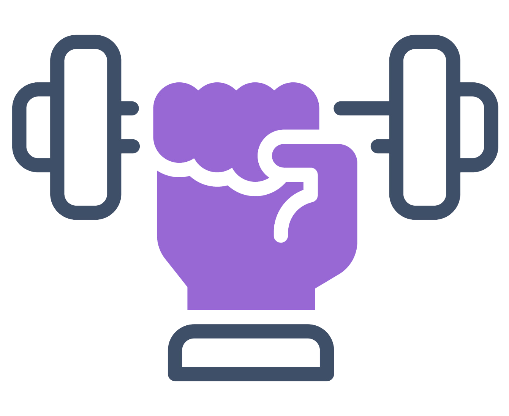

<!--
Hey, thanks for using the awesome-readme-template template.  
If you have any enhancements, then fork this project and create a pull request 
or just open an issue with the label "enhancement".

Don't forget to give this project a star for additional support ;)
Maybe you can mention me or this repo in the acknowledgements too
-->

  
  <h1>Fit-App</h1>
  
  

    A Flutter project with Firebase! 
  

  
  
<!-- Badges -->

  
  
  
  
  

   

 

<!-- About the Project -->
## :star2: About the Project

Fit-App is a Flutter project that integrates Firebase for Authentication and Cloud Firestore. Fit-App uses Android Permissions for Activity Recognition. 

  <!-- Features -->
### :dart: Features

- StepCounter. 
- PassiveCaloriesStepCounter.
- Distance.
- Fit Suggestions.
- Personal information such as weight, height, etc. for more accurate calculations. ℹ️
- You can select the activity you perform and enter the time for the calculation of active calories. ⏲️
- Activities: Walking, Running, Cycling, Weightlifting, Jumping and Dancing 🏃

### Built With

* 
* 
* 
* 

